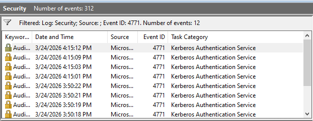
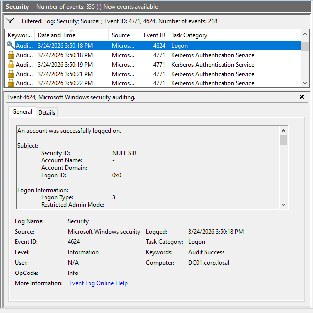
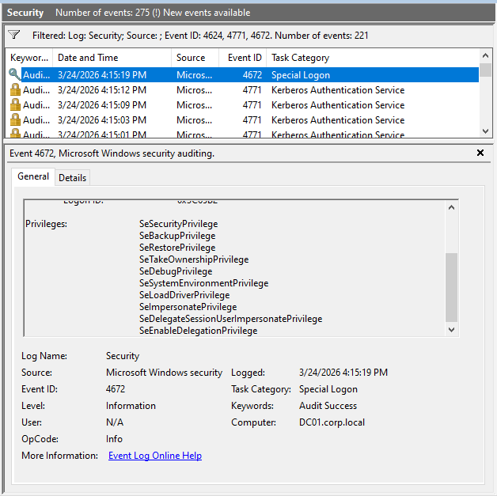
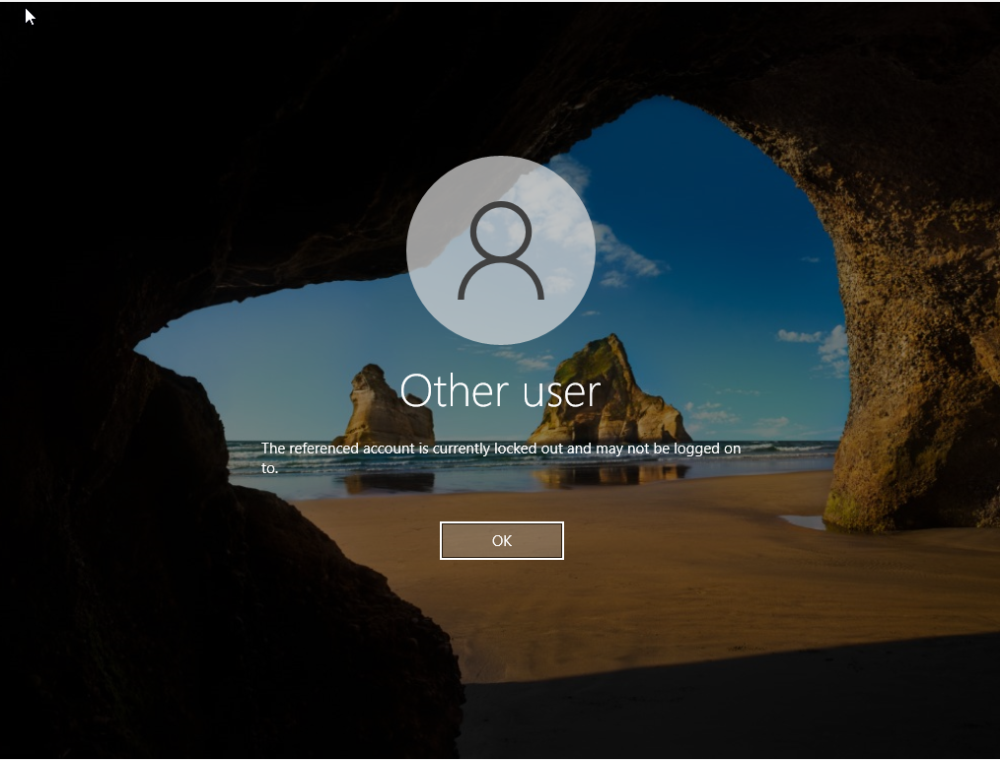

# Day 04 - Authentication Attacks & Detection

## Objective
Simulate authentication-based attacks in an Active Directory environment and analyze Windows Security logs to detect password spraying, successful authentication, privileged access, and account lockout enforcement.

---

## Lab Environment
- Domain: corp.local
- Domain Controller: DC01
- Client: Windows 10 (Domain Joined)
- Security Controls: Account Lockout Policy Enabled

---

## Attack Scenario Overview

This lab demonstrates a realistic authentication attack sequence:

1. Password spraying (multiple failed attempts)
2. Successful user authentication
3. Privileged account logon
4. Account lockout triggered by security policy

---

## 1. Password Spraying Activity (Event ID 4771)

Multiple failed authentication attempts were generated against a domain account.

### Evidence:
- Event ID **4771** (Kerberos Pre-Authentication Failed)
- Indicates repeated incorrect password attempts

📸 Screenshot:

---

## 2. Successful Authentication (Event ID 4624)

After repeated failed attempts, a correct password was entered.

### Evidence:
- Event ID **4624** (Successful Logon)
- Logon Type: 3 (Network Logon)

### Analysis:
A successful login following multiple failures may indicate credential compromise or password guessing success.

📸 Screenshot:

---

## 3. Privileged Account Logon (Event ID 4672)

A domain administrator account (`CORP\admin1`) was used to authenticate.

### Evidence:
- Event ID **4672** (Special Privileges Assigned)

### Observed Privileges:
- SeDebugPrivilege  
- SeBackupPrivilege  
- SeRestorePrivilege  
- SeTakeOwnershipPrivilege  
- SeImpersonatePrivilege  

### Analysis:
This event confirms elevated privileges were assigned, indicating administrative-level access. This is a high-value security event commonly monitored in enterprise environments.

📸 Screenshot:

---

## 4. Account Lockout Enforcement

After exceeding the configured failed login threshold, the account was locked.

### Evidence:
- Login denied with account lockout message
- Lockout policy successfully enforced

### Analysis:
This demonstrates defensive controls functioning correctly to prevent continued brute-force attempts.

📸 Screenshot:

---

## Event Correlation (Attack Timeline)

The following sequence was observed:

---

## Detection Analysis

- Repeated **4771 events** indicate password spraying or brute-force attempts  
- A **4624 event following failures** suggests successful authentication after guessing credentials  
- **4672 event** confirms elevated privileges assigned to the session  
- Account lockout demonstrates enforcement of security policy and mitigation of further attack attempts  

---

## Key Takeaways

- Authentication logs provide strong indicators of attack behavior  
- Event correlation is critical for identifying compromise patterns  
- Privileged logons (4672) are high-risk events and should be monitored closely  
- Account lockout policies are effective in limiting brute-force attacks  

---

## Skills Demonstrated

- Active Directory attack simulation  
- Windows Security Event log analysis  
- Authentication event correlation  
- Detection of password spraying patterns  
- Privileged access monitoring  
- Security control validation (account lockout policy)  

---

## Outcome

Successfully simulated and analyzed a full authentication attack lifecycle, including detection of password spraying, identification of successful compromise, monitoring of privileged access, and validation of defensive controls within an enterprise Active Directory environment.

---
