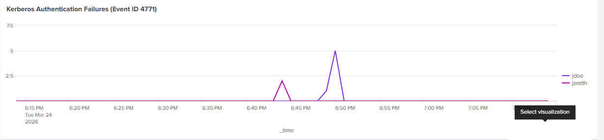
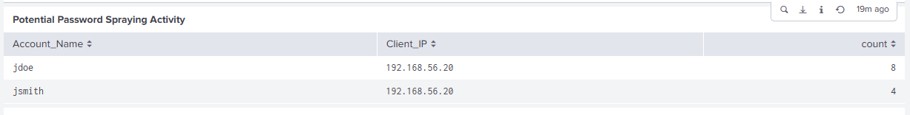
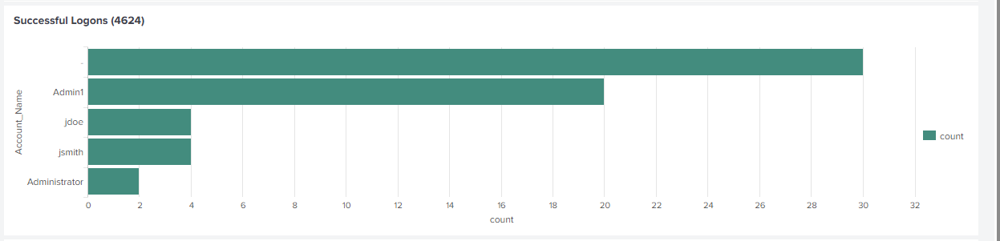
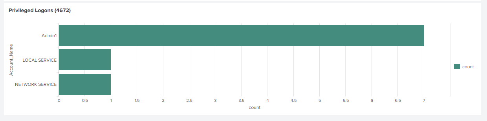
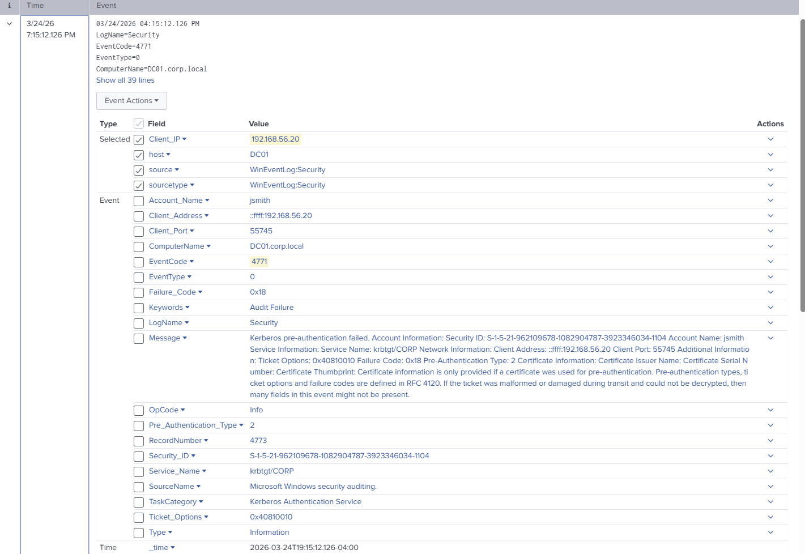
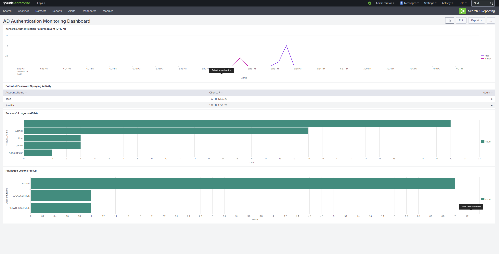

# Day 05 - SIEM Integration & Authentication Monitoring Dashboard

## Objective
Integrate Active Directory logs into Splunk SIEM and build a detection dashboard to identify authentication failures, password spraying activity, successful logons, and privileged access events.

---

## Environment
- Domain Controller: DC01 (corp.local)
- SIEM Platform: Splunk Enterprise
- Log Forwarder: Splunk Universal Forwarder
- Data Sources:
  - WinEventLog:Security
  - WinEventLog:System
  - WinEventLog:Application

---

## SIEM Integration Overview

The Domain Controller was configured with the Splunk Universal Forwarder to ingest Windows Event Logs into Splunk Enterprise. Security events were successfully parsed and indexed, enabling real-time monitoring and detection.

---

## Key Event IDs Monitored

| Event ID | Description |
|--------|-------------|
| 4624 | Successful Logon |
| 4771 | Kerberos Pre-Authentication Failure |
| 4672 | Special Privileges Assigned |

---

## Detection Dashboard

A centralized dashboard was created to monitor authentication activity and identify suspicious behavior.

---

## Detection Panels

### 1. Kerberos Authentication Failures (4771)
Monitors failed Kerberos authentication attempts over time.

---

### 2. Potential Password Spraying Activity
Identifies accounts receiving multiple failed authentication attempts from the same source IP.

---

### 3. Successful Logons (4624)
Displays successful authentication events by account.

---

### 4. Privileged Logons (4672)
Highlights accounts receiving elevated privileges during logon.

---

## Raw Event Analysis

Detailed inspection of individual authentication events was performed to validate detection logic.

### Example: Kerberos Authentication Failure Event (4771)
- Account_Name: jsmith
- Client_IP: 192.168.56.20
- EventCode: 4771
- ComputerName: DC01.corp.local

---

## Dashboard Overview

Full view of the AD Authentication Monitoring Dashboard.

---

## Detection Logic

### Password Spraying Detection
Multiple failed authentication attempts (EventCode 4771) from a single source IP targeting multiple accounts were identified as password spraying behavior.

### Authentication Monitoring
Successful logons (4624) were analyzed to differentiate normal user behavior from suspicious access.

### Privilege Monitoring
EventCode 4672 was used to track elevated privilege assignments during authentication.

---

## Key Takeaways

- Successfully integrated Windows Event Logs into Splunk SIEM
- Built a functional authentication monitoring dashboard
- Detected password spraying behavior using Kerberos failure events
- Correlated authentication activity across multiple event types
- Performed raw event analysis to validate detection accuracy

---

## Outcome

Developed a working SIEM pipeline and dashboard capable of identifying authentication-based attacks and privileged access activity in an Active Directory environment.

This project demonstrates hands-on experience with log ingestion, detection engineering, and security event analysis using Splunk.
